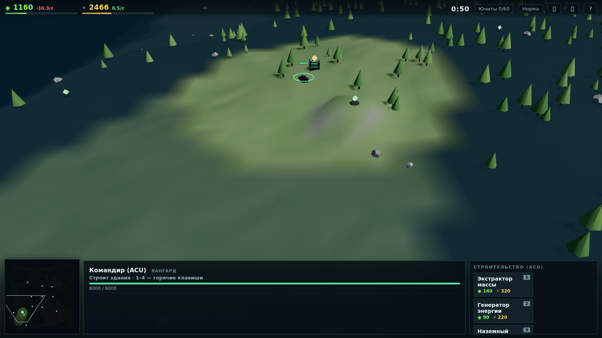

# ⚔️ FORGED ARENA

**Браузерная 3D RTS в духе Supreme Commander: Forged Alliance** — без движков уровня Unity, на чистом JavaScript + [Three.js](https://threejs.org/).



## 🎮 Что внутри

Всё, что делает SupCom SupCom'ом — в миниатюре, прямо в браузере:

- **Экономика массы и энергии** — ресурсы добываются непрерывно и так же непрерывно
  списываются во время стройки и производства. Нехватка ресурсов не останавливает,
  а *замедляет* процессы — как в оригинале.
- **Командир (ACU)** — строит базу, отбивается, а при гибели детонирует ядерным
  взрывом, уничтожая всё вокруг. Потеряли ACU — проиграли партию.
- **Стратегический зум** — плавный откат камеры от тактического вида до обзора
  всей карты, на дальнем зуме юниты превращаются в плоские иконки.
- **Туман войны** — разведка местности, вражеские юниты видны только в зоне
  обзора ваших войск.
- **Залежи массы** — экстракторы строятся только на месторождениях; победа
  достаётся тому, кто контролирует карту.
- **ИИ-противник** — развивает экономику, строит заводы, обороняет базу и
  присылает нарастающие волны атак. Три уровня сложности.
- **Приказы** — движение строем, атака, атака-марш, патруль, очередь приказов
  через Shift, точка сбора для заводов.
- Миникарта с туманом и пингами, рамка выделения, двойной клик — все юниты
  типа, Ctrl+A — вся армия, горячие клавиши 1–4.

### Юниты и постройки

| | Масса | Энергия | Время | Примечание |
|---|---|---|---|---|
| ◉ Экстрактор | 140 | 320 | 10 с | +3.5 массы/с, только на залежах |
| ⚡ Генератор | 90 | 220 | 8 с | +16 энергии/с |
| 🏭 Завод | 320 | 1100 | 18 с | производит юниты |
| 🔥 Турель | 160 | 520 | 9 с | автоматическая оборона |
| «Страж» (танк) | 95 | 180 | 7 с | быстрый и дешёвый |
| «Молот» (тяж. танк) | 240 | 520 | 14 с | броня и урон |
| «Гроза» (артиллерия) | 170 | 700 | 12 с | навесной огонь по площади |

## ⌨️ Управление

| Действие | Клавиша |
|---|---|
| Выбор / рамка выделения | **ЛКМ** |
| Движение, атака, достройка, точка сбора | **ПКМ** |
| Атака-марш (бой по пути) | **A** + ЛКМ |
| Патруль | **P** + ЛКМ |
| Очередь приказов | **Shift** + приказ |
| Стратегический зум | **Колесо мыши** |
| Камера | **Стрелки** / зажатая **СКМ** / край экрана |
| Центрировать на командире | **Пробел** |
| Выбрать всю армию | **Ctrl + A** |
| Горячие клавиши стройки/производства | **1–4** |
| Стоп / отмена | **S** / **Esc** |
| Звук / помощь | **M** / **F1** |

## 🚀 Запуск

Игра — статический сайт, сборщики не нужны.

**Локально** (ES-модули требуют http-сервер, `file://` не подойдёт):

```bash
git clone https://github.com/Botamineecraft/Rts-strategy.git
cd Rts-strategy
python3 -m http.server 8080
# открыть http://localhost:8080
```

**GitHub Pages**: Settings → Pages → Source: `main` / root — и игра доступна по
адресу `https://<пользователь>.github.io/Rts-strategy/`.

## 🛠 Технологии

- **Three.js r160** — рендер, тени, туман сцены.
- Вся геометрия юнитов и зданий **генерируется кодом** из примитивов и сливается
  в единые буферы с vertex colors — никаких внешних моделей и текстур.
- Процедурный остров: шум высот, вода, растительность (InstancedMesh).
- Эффекты: снаряды (InstancedMesh), взрывы (Points + аддитивный блендинг),
  вспышки (спрайты), ядерный взрыв ACU с тряской камеры.
- Звук — процедурный WebAudio (без ассетов).
- ~3500 строк JS без зависимостей кроме Three.js.

### Структура

```
├── index.html          — разметка и HUD
├── css/style.css       — интерфейс
├── js/
│   ├── main.js         — точка входа, игровой цикл
│   ├── config.js       — баланс и характеристики
│   ├── state.js        — общее состояние
│   ├── world.js        — террейн, вода, декорации
│   ├── entities.js     — юниты, здания, приказы, бой
│   ├── economy.js      — масса/энергия, стройка, производство
│   ├── combat.js       — снаряды и эффекты
│   ├── fog.js          — туман войны
│   ├── ai.js           — ИИ противника
│   ├── input.js        — камера и управление
│   ├── ui.js           — HUD, иконки, миникарта
│   └── sound.js        — процедурный звук
├── libs/three.module.js
└── test/smoke.mjs      — headless-тест логики (node test/smoke.mjs)
```

## ✅ Тесты

```bash
node test/smoke.mjs
```

Headless-прогон игровой логики без DOM/WebGL: экономика, стройка, производство
ИИ, бой, ядерный взрыв ACU, отсутствие отрицательных ресурсов.

---

*Проект создан как homage к Supreme Commander: Forged Alliance (Gas Powered Games / THQ).
Не аффилирован с правообладателями.*
